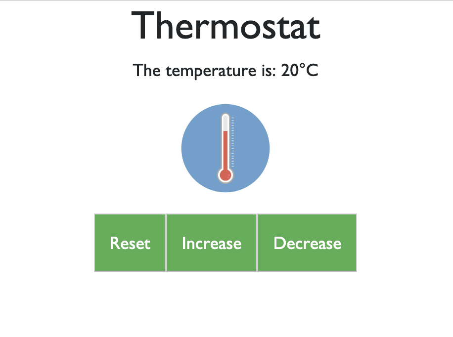

# Thermostat

Rebuilding my Makers Academy <a href="https://github.com/jordantroberts/thermostat-js">Thermostat</a> project as a single page application with C# for the backend and React for the frontend.

# How to run this program

This program has been published to Azure <a href="https://thermostattestproject.azurewebsites.net/">here</a>

# How to test this program

1. Clone this repo.
2. Open the project in Visual Studio.
3. Build the project which will automatically run the unit tests (note: I use Visual Studio Community)

# How to use this program

    

The minimum temperature has been set at 10 degrees and the maximum 30 degrees. You can increase and decrease the thermostat temperature within this range. The 'reset' button will reset the temperature back to 20 degrees.

# Acknowledgments
- Jordan Roberts
- Originally a Makers Academy week project
